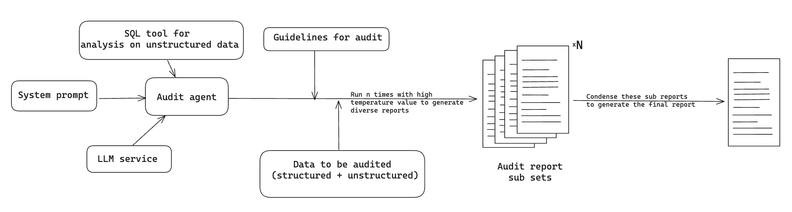

# CamelBot - BOB Hackathon

## Introduction

Welcome to CamelBot, a cutting-edge financial auditor tool developed for the BOB Hackathon. CamelBot is designed to streamline the audit process by integrating generative AI technologies. It can process both structured and unstructured data efficiently, utilizing SQL and RAG (Retrieval-Augmented Generation) to generate detailed, reliable audit reports. This tool is particularly useful for financial analysts and auditors looking to enhance accuracy and efficiency in their work.

## Key Features

- **Advanced Data Analysis**: CamelBot can analyze a mix of structured and unstructured data, providing comprehensive insights.
- **AI-Driven Reports**: Utilizes generative AI to produce diverse sub-reports, which are then condensed into a final detailed audit report.
- **User-Friendly Interface**: Features a Streamlit-based chatbot that guides users through the audit guidelines, enhancing user experience and accessibility.
- **Flexible and Scalable**: Designed to handle varying volumes and types of data, making it suitable for both small businesses and large enterprises.



*Currently the `AuditPipeline` notebook showcases the entire workflow while the streamlit chatbot only allows one to interact with the guideline. We will be adding the auditing feature into the chatbot soon*

## Prerequisites

Ensure you have the following prerequisites installed on your machine:

- Python 3.8 or later
- Git (for cloning the repository)

## Installation Guide

### Step 1: Obtain the Source Code

##### First, clone the repository to your local machine using Git:

```bash
git clone <repository-url>
cd <project_repo>
```

### Step 2: Environment Setup
##### Set up a virtual environment to manage the dependencies separately from your global Python installation:

##### On Windows:

```bash
python -m venv venv
venv\Scripts\activate
```

##### On macOS and Linux:

```bash
python3 -m venv venv
source venv/bin/activate
```

## Step 3: Install Dependencies
##### With the environment activated, install all necessary dependencies:

```bash
pip install -r requirements.txt
```

## Running the Application
##### To start CamelBot, navigate to the project directory and run the following command:

```bash
streamlit run _Connect.py
```

##### This command launches the Streamlit interface where you can interact with the CamelBot chatbot and begin the audit process.

### Sample prompts to ask CamelBot
- `A foreign student has come to open a bank account, what are the guidelines to follow?`
- `There is a transaction of 2,00,000 in a savings account. What should I do?`

 
# Documentation
For a complete walkthrough of the audit Proof of Concept (POC) workflow, including examples, refer to the Jupyter notebook provided in the repository. This notebook details the entire process from initial data preparation to the generation of the final audit report, providing practical insights into the tool’s capabilities.

# Support
If you encounter any issues or have questions, please feel free to open an issue on the GitHub repository or contact the development team through the support channels provided.

# Contribution
Contributions are welcome! If you would like to improve CamelBot, please fork the repository, make your changes, and submit a pull request. We appreciate your input in making CamelBot even better!

Thank you for choosing CamelBot for your auditing needs. We hope it serves you well!
